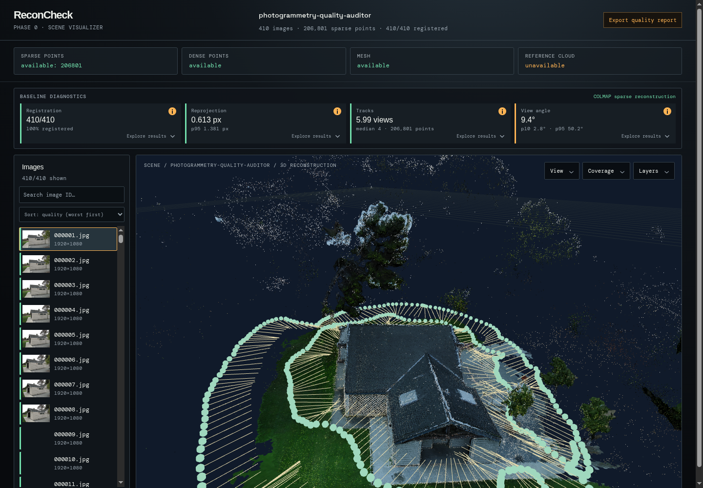
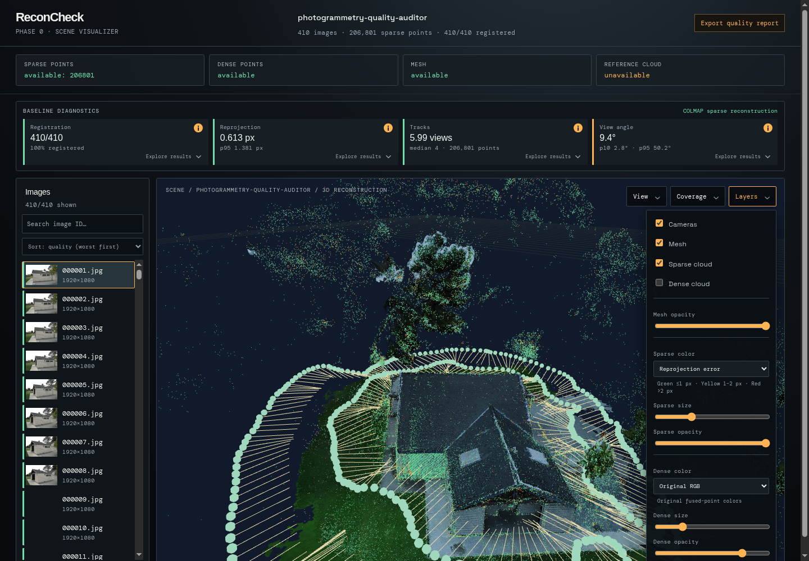
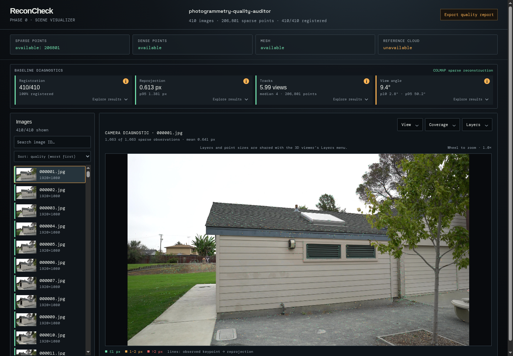

# ReconCheck

[](https://pypi.org/project/reconcheck/)
[](https://pypi.org/project/reconcheck/)
[](LICENSE)

**Inspect a photogrammetry dataset, understand what went wrong, and export the evidence—locally.**

ReconCheck is a local photogrammetry dataset quality auditor and COLMAP reconstruction visualizer. It evaluates image health and reconstruction quality, explains detected problems, and exports a portable JSON report without uploading or modifying the source dataset.



## Why ReconCheck

A reconstruction can finish successfully and still contain weak coverage, poorly supported geometry, high-error observations, or unhealthy source images. Aggregate statistics alone make those problems difficult to locate.

ReconCheck brings the source images, registered cameras, sparse and dense geometry, diagnostic distributions, and per-camera reprojection evidence into one workspace. It is intended for dataset triage, capture feedback, reconstruction debugging, and reproducible quality reporting—not as a replacement for ground-truth geometric validation.

## Highlights

- **One-command local analysis** of common COLMAP project layouts.
- **Image-health checks** for sharpness, exposure, clipping, contrast, and near duplicates.
- **Reconstruction diagnostics** covering registration, reprojection error, track support, viewing geometry, and spatial coverage.
- **Interactive 3D inspection** of registered cameras, sparse points, dense clouds, and meshes.
- **Per-camera debugging** with observed keypoints and reprojection residual vectors.
- **Portable JSON reports** with findings, recommendations, measurements, and provenance hashes.
- **Privacy-first operation:** localhost only, no uploads, and read-only source handling.
- **Image-only partial reports** when no sparse reconstruction is available.

## Install and run

Use `pipx` for an isolated command-line installation:

```bash
pipx install reconcheck
reconcheck analyze /path/to/colmap-project
```

Or run it without installing:

```bash
uvx reconcheck analyze /path/to/colmap-project
```

ReconCheck discovers common COLMAP layouts and opens the viewer in your default browser. A typical project can contain:

```text
project/
├── images/
├── database.db              # optional
├── sparse/0/                # optional; binary or text COLMAP model
└── dense/
    ├── fused.ply            # optional
    └── meshed-poisson.ply   # optional
```

For a non-standard layout, provide paths explicitly:

```bash
reconcheck analyze /data/project \
  --images source-images \
  --sparse reconstruction/sparse/0 \
  --database reconstruction/database.db \
  --dense outputs/cloud.ply \
  --mesh outputs/mesh.ply
```

Paths may be absolute or relative to the project directory. Use `--refresh` to rebuild a cached analysis and `--no-browser` to prevent automatic browser launch.

## Visual inspection and debugging

### Reconstruction overview

Inspect registration, reprojection error, track support, viewing angles, source images, camera trajectories, sparse points, dense points, and meshes in one workspace. Diagnostic cards expose distributions rather than only aggregate scores.

### Quality controls



Toggle reconstruction layers and color the sparse cloud by original RGB, track support, maximum view angle, or reprojection error. Point-size and opacity controls make weakly supported or high-error regions easier to locate spatially.

### Camera diagnostics



Open a registered camera to compare observed keypoints with their reprojections. Error-colored points and residual vectors help reveal local alignment problems, weak image regions, and outlier observations.

The screenshots use the **Barn** training scene from [Tanks and Temples](https://www.tanksandtemples.org/). Refer to the dataset's [license terms](https://www.tanksandtemples.org/license/) for source-data usage conditions.

## Quality report

The viewer's **Export quality report** action downloads a JSON document containing:

- a `good`, `warning`, or `poor` verdict;
- a versioned general-photogrammetry quality profile;
- registration, reprojection, track, view-angle, and coverage measurements;
- per-image sharpness, exposure, clipping, contrast, hashes, and reconstruction metrics;
- findings and corrective recommendations;
- sparse, dense, and mesh provenance hashes when available.

An image directory without a COLMAP sparse model receives a clearly marked partial report covering image health. Metrics requiring reconstruction evidence are reported as unavailable rather than inferred.

> **Interpretation boundary:** these measurements evaluate internal consistency. Without reference geometry, they do not establish absolute geometric accuracy.

## Privacy and storage

ReconCheck runs locally and binds to `127.0.0.1` by default. It does not upload data and does not modify source datasets. Derived scene assets and reports are cached in the operating system's standard ReconCheck application-data directory.

## Technical overview

ReconCheck combines a Python analysis and API layer with a TypeScript/React viewer:

```text
COLMAP project / image directory
              ↓
  discovery + immutable fingerprints
              ↓
 image and reconstruction diagnostics
              ↓
 normalized local scene + quality report
              ↓
       FastAPI on 127.0.0.1
              ↓
    React / TypeScript 3D viewer
```

The Python package uses FastAPI, NumPy, Pillow, pycolmap, and Uvicorn. The bundled frontend provides interactive reconstruction and camera diagnostics while keeping the public workflow to a single `reconcheck analyze` command.

## Development

```bash
uv sync --dev
cd frontend
npm ci
npm run build
cd ..
rm -rf src/reconcheck/static
cp -r frontend/dist src/reconcheck/static
uv run pytest
uv run ruff check src tests
uv build
```

## Scope and maturity

ReconCheck is an early-stage open-source tool. Quality thresholds are a declared general-purpose profile, not universal truth; suitable thresholds depend on the camera, scene, reconstruction settings, and downstream use. Reports retain measurements and evidence so their verdict can be interpreted rather than accepted as a black box.

Issues and constructive feedback are welcome through the [GitHub issue tracker](https://github.com/Gre3nLioN/reconcheck/issues).

## License

Licensed under the [MIT License](LICENSE).
